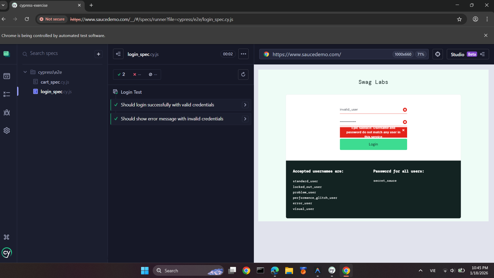
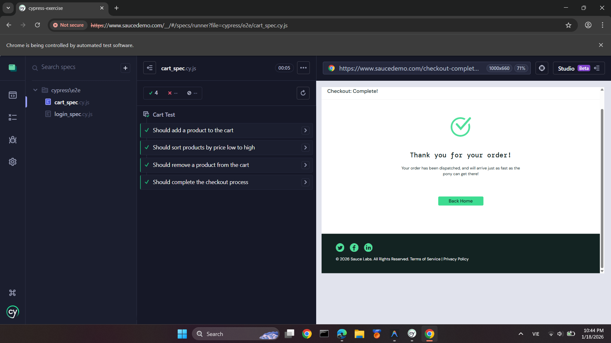

# Bài tập thực hành kiểm thử tự động End-to-End với Cypress

Dự án này thực hiện các kịch bản kiểm thử tự động (E2E) cho trang web [Saucedemo](https://www.saucedemo.com) bằng cách sử dụng Cypress.

## Mục tiêu
- Thực hành cài đặt và sử dụng Cypress.
- Viết các kịch bản kiểm thử đăng nhập, giỏ hàng, sắp xếp và thanh toán.
- Kiểm tra các chức năng xóa sản phẩm và hoàn tất quy trình mua hàng.

## Cấu trúc thư mục
- `cypress/e2e/login_spec.cy.js`: Chứa các kịch bản kiểm thử đăng nhập (Thành công & Thất bại).
- `cypress/e2e/cart_spec.cy.js`: Chứa các kịch bản kiểm thử giỏ hàng, sắp xếp, xóa sản phẩm và thanh toán.

## Hướng dẫn cài đặt và chạy
1. **Cài đặt dependencies**:
   ```bash
   npm install
   ```
2. **Mở Cypress (Giao diện người dùng)**:
   ```bash
   npx cypress open
   ```
3. **Chạy kiểm thử (Headless mode)**:
   ```bash
   npx cypress run --browser chrome
   ```

## Kết quả kiểm thử

### Ảnh chụp màn hình (Screenshots)
>login_spec.cy.js


>cart_spec.cy.js


---

### Video kết quả (Video Recording)
>[Video kết quả](https://drive.google.com/file/d/17-vtdETIqgdtHR3UC1cWxsYBhhQOa41o/view?usp=drive_link)

---

## Các kịch bản đã thực hiện
1. **Kiểm tra đăng nhập thành công**: Dùng `standard_user`.
2. **Kiểm tra đăng nhập thất bại**: Kiểm tra thông báo lỗi "Username and password do not match".
3. **Thêm sản phẩm vào giỏ hàng**: Kiểm tra badge giỏ hàng hiện số 1.
4. **Sắp xếp sản phẩm**: Kiểm tra chức năng lọc "Price (low to high)".
5. **Xóa sản phẩm khỏi giỏ hàng**: Kiểm tra badge giỏ hàng biến mất sau khi xóa.
6. **Quy trình thanh toán**: Kiểm tra từ giỏ hàng đến trang "Thank you for your order!".
